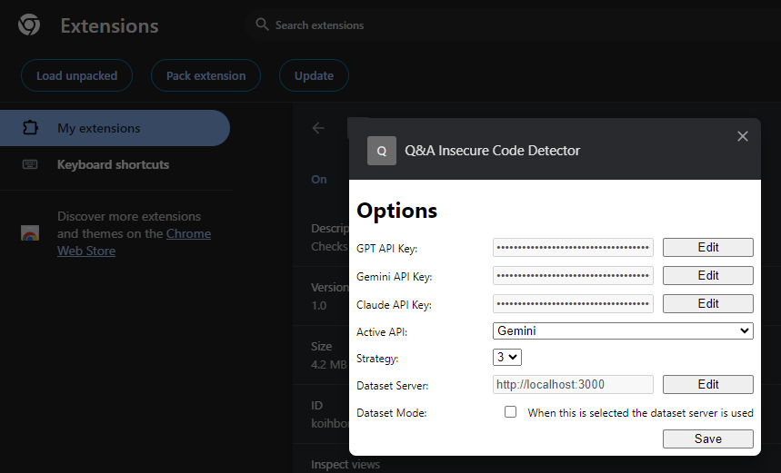
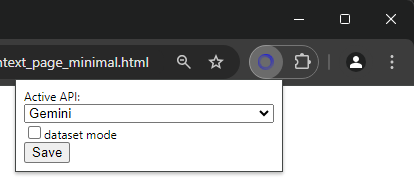

# AI based insecure code detection on Q&A sites (Master gratuation project).

Chrome Extension, TypeScript and Visual Studio Code

## Prerequisites

* [node + npm](https://nodejs.org/) (Current Version)

## Option

* [Visual Studio Code](https://code.visualstudio.com/)

## Includes the following

* TypeScript
* Webpack
* React
* Jest

## Project Structure

* src/typescript: TypeScript source files
* src/assets: static files
* dist: Chrome Extension directory
* dist/js: Generated JavaScript files

## Setup

### Install dependencies

```
npm install
```

### Build

```
npm run build
```

### Build in watch mode

```
npm run watch
```

or

type <kbd>Ctrl</kbd> + <kbd>Shift</kbd> + <kbd>B</kbd> (vsCode)

### Load extension to chrome

Load `dist` directory
<br>
<br>

### Test

`npx jest` or `npm run test`
<br>
<br>

### Run en debug (vsCode)

Start context_page.html in Chrome with extension installed through launch-file: 

'Run and Debug' tab (<kbd>Ctrl</kbd>+<kbd>Shift</kbd>+<kbd>D</kbd>) -> play 

or

vsCode menu => Run => 'Start Debugging' (<kbd>F5</kbd>)

When started, 'context_page_minimal.html' opens in Chrome (Chrome must be installed). To open 'context_page.html', change the 'file' parameter in 'launch.json'.

If the extension is in 'dataset mode', the HTML page is cleared, and dataset information is injected into the page.

LLM API keys can be added through the extension menu (right-click the extension icon and select "Options"). See image:



In this menu, you can also activate 'dataset mode' and switch between LLMs and strategies.

Switching to another LLM and activating 'dataset mode' can also be done through the popup dialog (click the extension icon).

.

